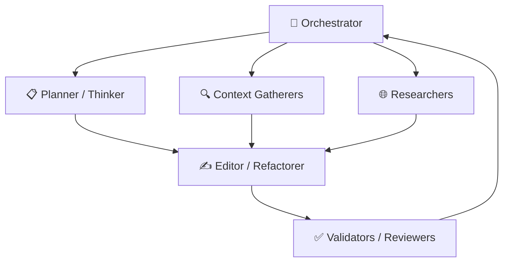

<div align="center">

# 🤖 OpenCode — Multi-Agent AI Architecture

**A production-grade multi-agent system for AI-assisted software engineering.**  
OpenCode orchestrates a team of specialized AI agents — each optimized for planning, reasoning, implementation, research, testing, and review — to build software more intelligently and safely.

[](LICENSE)
[](https://opencode.ai)
[](CONTRIBUTING.md)

</div>

---

# ✨ Why Multi-Agent?

Most AI coding assistants rely on a single model to do everything:
planning, coding, debugging, reviewing, testing, and researching.

That approach quickly breaks down on large or complex codebases.

OpenCode solves this by splitting responsibilities across a network of specialized agents.

Each agent is optimized for a single responsibility:

- 🧠 Deep reasoning
- 🔍 Repository exploration
- 🌐 Documentation & web research
- ✍️ Code implementation
- ♻️ Safe refactoring
- 🛡️ Security review
- ✅ Testing & validation
- 💻 Interactive terminal execution

This architecture produces:

- Better planning before edits
- More accurate context gathering
- Cleaner and safer implementations
- Stronger validation loops
- Reduced hallucinations
- Easier model swapping & experimentation

---

# 🏗️ Architecture Overview



Every request begins with the **Orchestrator**.

The orchestrator decides:

- Which agents are needed
- Which files should be explored
- Which models are most appropriate
- Whether changes require testing or review
- Whether additional research is necessary

This creates a workflow similar to a high-performing engineering team instead of a single autocomplete model.

---

# 🧑‍💻 Agent System

## Core Orchestration

| Agent | Responsibility | Model | Temp |
|---|---|---|---|
| `orchestrator` | Main coordinator (default mode) | kimi-k2.6 | 0.1 |
| `orchestrator-max` | Deep-context orchestration | mimo-v2.5-pro | 0.1 |
| `orchestrator-plan` | Planning-only mode | deepseek-v4-pro | 0.2 |

---

## Planning & Reasoning

| Agent | Responsibility | Model |
|---|---|---|
| `planner` | Structured execution planning | deepseek-v4-pro |
| `thinker` | Deep reasoning without tools | mimo-v2.5-pro |

---

## Context Gathering

| Agent | Responsibility | Model |
|---|---|---|
| `file-picker` | Intelligent fuzzy file discovery | deepseek-v4-flash |
| `code-searcher` | Mechanical repository search | minimax-m2.5 |
| `librarian` | Repository structure exploration | minimax-m2.5 |

---

## Research

| Agent | Responsibility | Model |
|---|---|---|
| `researcher-web` | External web research | qwen3.6-plus |
| `researcher-docs` | Documentation analysis | minimax-m2.5 |

---

## Implementation

| Agent | Responsibility | Model |
|---|---|---|
| `editor` | Primary code implementation | qwen3.6-plus |
| `refactorer` | Safe structural refactoring | glm-5.1 |

---

## Validation & Review

| Agent | Responsibility | Model |
|---|---|---|
| `code-reviewer` | Multi-perspective review | minimax-m2.7 |
| `security-reviewer` | Vulnerability analysis | deepseek-v4-pro |
| `debugger` | Systematic debugging | kimi-k2.6 |
| `test-runner` | Test execution & analysis | minimax-m2.5 |

---

## Execution & Automation

| Agent | Responsibility | Model |
|---|---|---|
| `basher` | Terminal command execution | deepseek-v4-flash |
| `tmux-cli` | Interactive CLI workflows | minimax-m2.5 |
| `browser-use` | Browser automation | glm-5.1 |

---

## Utility Agents

| Agent | Responsibility | Model |
|---|---|---|
| `general-agent` | Flexible general-purpose tasks | kimi-k2.6 |

---

Additionally, OpenCode includes hidden infrastructure agents such as:

- Context pruning
- Token optimization
- Conversation compression
- Delegation management

These work automatically behind the scenes.

---

# 🚀 Quick Start

## 1. Install OpenCode

Install the OpenCode CLI and configure your provider API keys.

Visit:

- https://opencode.ai

---

## 2. Clone This Repository

```bash
git clone https://github.com/TamTH-Dev/opencode.git ~/.opencode
```

Or place the agents directly inside your project:

```text
.opencode/agents/
```

---

## 3. Start OpenCode

```bash
opencode
```

The orchestrator will automatically discover and load all agent definitions.

No additional setup required.

---

# 🧠 Model Routing Strategy

OpenCode routes tasks to models based on strengths.

## Reasoning

- **MiMo V2.5 Pro**
  - Long-context reasoning
  - Strategic planning
  - Architectural thinking

## Orchestration

- **Kimi K2.6**
  - Strong general coordination
  - Reliable tool usage
  - Balanced cost/performance

## Analysis & Planning

- **DeepSeek V4 Pro**
  - Excellent analytical capability
  - Structured planning
  - Strong code understanding

## Fast Mechanical Tasks

- **DeepSeek V4 Flash**
- **MiniMax M2.5**

Used for:

- Search
- File discovery
- Mechanical operations
- Fast execution

## Implementation & Refactoring

- **Qwen 3.6 Plus**
- **GLM 5.1**

Optimized for:

- Stable code generation
- Refactoring precision
- Large file edits

---

# 🌡️ Temperature Strategy

Different tasks require different creativity levels.

| Task Type | Temperature |
|---|---|
| Deterministic editing | `0.0` |
| Planning & reasoning | `0.1 - 0.2` |
| Research & exploration | `0.2 - 0.3` |

This keeps code changes stable while still allowing flexible reasoning when needed.

---

# 📁 Project Structure

```text
.
├── agents/                          # Main production agents
├── testing-agents/                  # Experimental agents
├── guidelines/
│   └── AGENTS.md                    # Shared coding rules
├── skills/                          # Optional integrations
├── AGENTS.md                        # AI-readable project instructions
├── MULTI_AGENT_ARCHITECTURE.md      # Architecture documentation
└── README.md
```

---

# 🎯 Design Principles

## Role-Based Architecture

Agents are named after responsibilities — not models.

This allows models to be swapped without changing system structure.

---

## Safety by Default

Read-only agents cannot modify files.

Editing agents are restricted to implementation responsibilities only.

---

## Verification Loops

Every meaningful change can pass through:

- Type checking
- Testing
- Code review
- Security review

before completion.

---

## Progressive Disclosure

The repository is designed to be readable by both:

- Humans
- AI agents

High-level docs provide quick understanding while deeper architecture docs expose implementation details.

---

# 🔄 Typical Workflow

```text
User Request
    ↓
Orchestrator
    ↓
Planning / Search / Research
    ↓
Implementation
    ↓
Testing & Review
    ↓
Final Response
```

---

# 📚 Documentation

| File | Purpose |
|---|---|
| `AGENTS.md` | AI-readable project instructions |
| `MULTI_AGENT_ARCHITECTURE.md` | Full architecture & routing |
| `guidelines/AGENTS.md` | Shared coding standards |

---

# 🤝 Contributing

Contributions are welcome.

You can contribute by:

- Adding new agents
- Improving prompts
- Optimizing model routing
- Enhancing workflows
- Improving validation systems
- Expanding documentation

## Development Workflow

```bash
git checkout -b feature/my-agent
```

Follow Conventional Commits when possible.

Open a Pull Request with a clear explanation of changes.